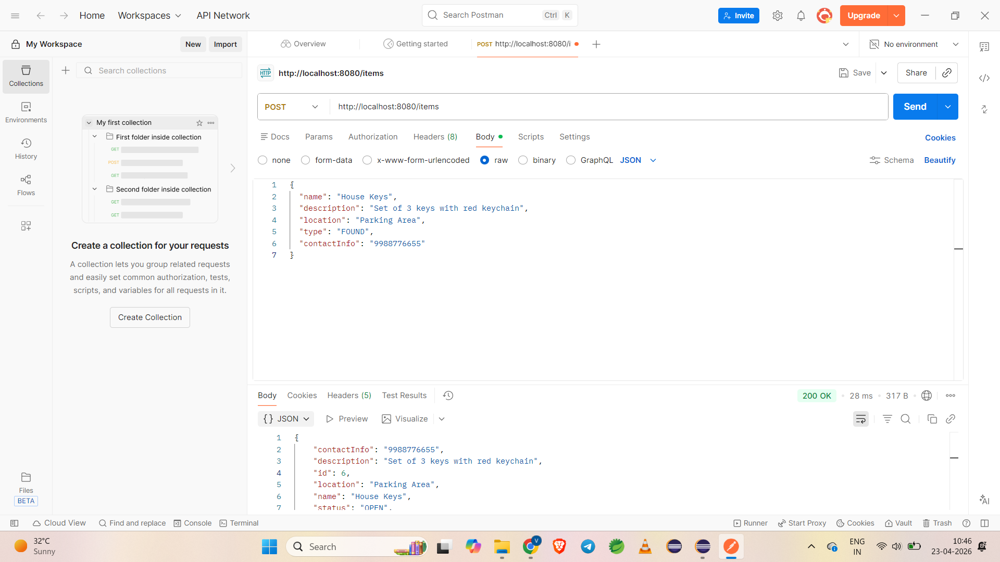
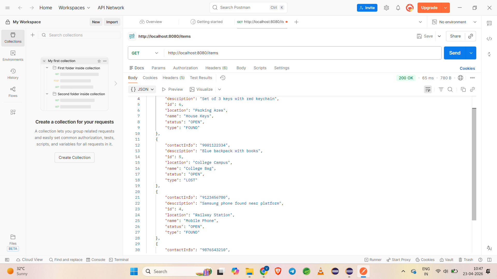
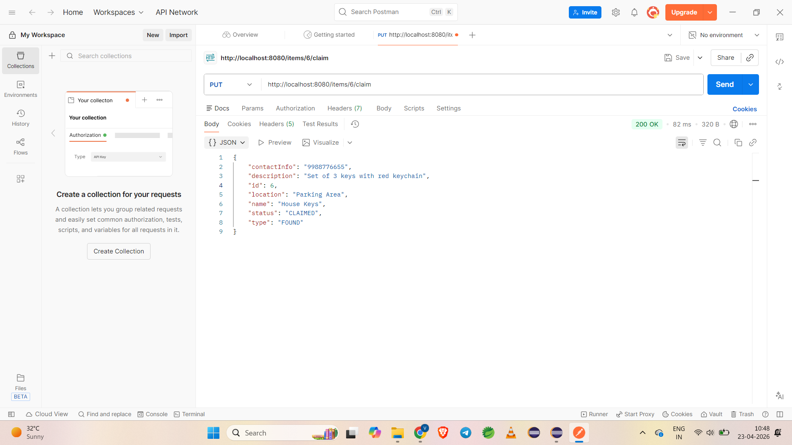

# Smart Lost & Found System

A Spring Boot REST API that allows users to report, track, and manage lost and found items efficiently.

---

## Overview

This project solves a real-world problem where users can report lost or found items. It supports CRUD operations, optimized searching, and follows clean architecture using Spring Boot.

---

## Features

* Create, Read, Update, Delete (CRUD)
* DTO pattern for clean API design
* Input validation using @Valid
* Global exception handling
* Search by location using HashMap (DSA)
* Sorting for latest items
* Claim item feature (status update)

---

## Tech Stack

* Java
* Spring Boot
* Spring Data JPA
* MySQL
* Maven
* Swagger (OpenAPI)
* Postman

---

## Project Structure

com.vikas.lostfound
│
├── controller
├── service
├── repository
├── entity
├── dto
├── exception
├── enums
├── config

---

## API Endpoints

POST /items → Create item
GET /items → Get all items
PUT /items/{id} → Update item
DELETE /items/{id} → Delete item
GET /items/search?location= → Search by location
PUT /items/{id}/claim → Mark as claimed

---

## Swagger API Documentation

Swagger (OpenAPI) is integrated into the project to provide interactive API documentation.

### Access Swagger UI

[http://localhost:8080/swagger-ui/index.html](http://localhost:8080/swagger-ui/index.html)

### Features

* View all API endpoints in one place
* Test APIs directly from the browser
* Understand request and response formats
* Improves developer experience and debugging

### Dependency Used

```xml
<dependency>
    <groupId>org.springdoc</groupId>
    <artifactId>springdoc-openapi-starter-webmvc-ui</artifactId>
    <version>2.5.0</version>
</dependency>
```

---

## How to Run

1. Clone the repository
   git clone [https://github.com/Vikasgabale9/lostfound-tracker.git](https://github.com/Vikasgabale9/lostfound-tracker.git)

2. Configure database in application.properties

3. Run the application
   mvn spring-boot:run

4. Access Swagger UI
   [http://localhost:8080/swagger-ui/index.html](http://localhost:8080/swagger-ui/index.html)

---

## Learning Outcomes

* Built REST APIs using Spring Boot
* Applied layered architecture
* Used DTO for data transfer
* Implemented exception handling
* Applied DSA concepts (HashMap, Sorting)
* Integrated Swagger for API documentation

---

## Future Enhancements

### Logging System

* Implement logging using SLF4J / Logback
* Track API requests and responses
* Helps in debugging and monitoring

### Pagination Support

* Implement pagination for large datasets
* Improves performance and response time
* Example: fetching items page-wise instead of all at once

### Security Enhancement

* Add Spring Security with JWT authentication
* Secure API endpoints

---

## Screenshots

### 🔹 Add Item (POST API)



---

### 🔹 Get All Items (GET API)



---

### 🔹 Claim Item (PUT API)



---

## Author

Vikas Gabale
GitHub: [https://github.com/Vikasgabale9](https://github.com/Vikasgabale9)
